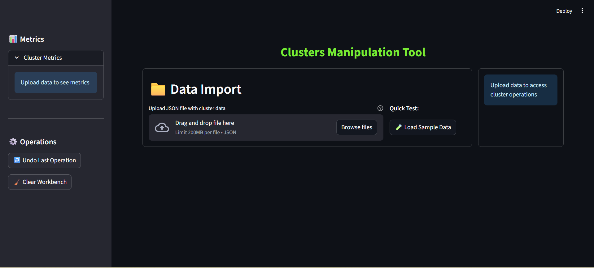
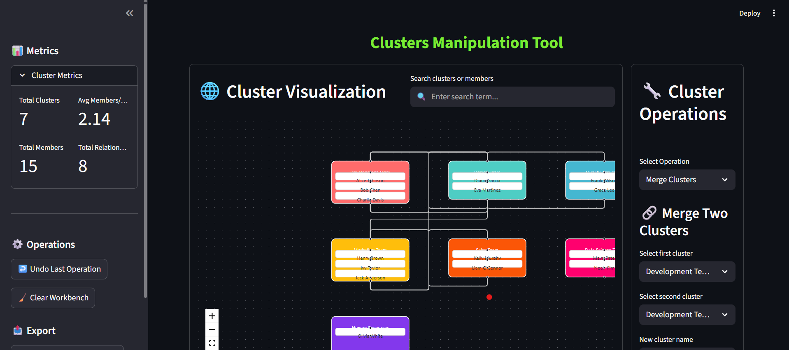

# Cluster Manipulation Tool 🔧

A powerful Streamlit application for visualizing, managing, and manipulating cluster data with an interactive flow-based interface.


## Features

- 📊 **Interactive Visualization**: Flow-based cluster visualization with member relationships
- 🔧 **Cluster Operations**: Merge, split, and move members between clusters  
- 🔍 **Search & Filter**: Real-time search across clusters and members
- ↩️ **Undo System**: Rollback operations with built-in history (up to 10 operations)
- 📤 **Data Export**: Download modified cluster data as JSON with timestamps
- 🧪 **Sample Data**: Quick testing with pre-loaded sample data
- 📱 **Responsive Design**: Works on desktop and mobile devices
- 🎨 **Dark/Light Mode**: Automatic theme support

## Screenshots



## Installation

### Prerequisites
- Python 3.8 or higher
- pip package manager

### Setup

1. **Clone the repository:**
```bash
git clone https://github.com/yourusername/cluster-manipulation-tool.git
cd cluster-manipulation-tool
```

2. **Create a virtual environment (recommended):**
```bash
python -m venv venv
source venv/bin/activate  # On Windows: venv\Scripts\activate
```

3. **Install dependencies:**
```bash
pip install -r requirements.txt
```

4. **Run the application:**
```bash
streamlit run app/main.py
```

5. **Open your browser** and navigate to `http://localhost:8501`

## Usage

### Data Format

Upload JSON files with the following structure example:

```json
{
  "clusters": [
    {
      "id": "cluster_1",
      "name": "Development Team",
      "members": [
        {
          "id": "member_1",
          "name": "John Doe",
          "metadata": {
            "role": "Senior Developer",
            "department": "Engineering"
          }
        },
        {
          "id": "member_2", 
          "name": "Jane Smith",
          "metadata": {
            "role": "UI/UX Designer",
            "department": "Design"
          }
        }
      ],
      "relationships": ["cluster_2", "cluster_3"]
    }
  ]
}
```

### Quick Start

1. **Load Data**: Upload your JSON file or click "Load Sample Data" for testing
2. **Visualize**: View your clusters in the interactive flow diagram
3. **Search**: Use the search bar to filter clusters and members
4. **Manipulate**: Use the operations panel to:
   - Merge two clusters
   - Move members between clusters
   - Split clusters into smaller ones
5. **Export**: Download your modified data as JSON

### Operations

#### Merge Clusters
- Select two different clusters
- Provide a name for the merged cluster
- All members and relationships are combined

#### Move Members
- Choose source and target clusters
- Select specific members to move
- Members are transferred with their metadata

#### Split Clusters
- Select a cluster with 2+ members
- Choose members for the new cluster
- Original cluster retains remaining members

## File Structure

```
cluster-manipulation-tool/
├── app/
│   ├── main.py              # Main Streamlit application
│   ├── cluster_manager.py   # Core cluster operations logic
│   ├── messages.py          # UI messages and constants
│   └── styles.py            # CSS styles and theming
├── data/
│   └── sample_data.json     # Sample data for testing
├── assets/
│   └── screenshots/         # Application screenshots
├── tests/
│   └── test_cluster_manager.py
├── requirements.txt         # Python dependencies
├── README.md               # This file
├── LICENSE                 # MIT License
├── .gitignore             # Git ignore rules
└── CONTRIBUTING.md        # Contribution guidelines
```

## Configuration

### Customization Options

- **Max History**: Modify `max_history` in `ClusterManager` (default: 10)
- **File Size Limit**: Adjust limit in `render_data_import()` (default: 10MB)
- **Color Palette**: Customize colors in `create_flow_visualization()`

## Troubleshooting

### Common Issues

1. **File Upload Fails**: Check file size (<10MB) and JSON validity

2. **Visualization Issues**: Refresh the page or clear browser cache

3. **Performance**: For large datasets (>100 clusters), consider data pagination

### Known Limitations

- Visualization performance may degrade with very large datasets
- Drag-and-drop functionality in flow diagram needs enhancement

## Future Work

### Planned Features

- 🎯 **Enhanced Visualization**: 
  - Fix drag-and-drop member movement in flow diagram
  - Member manipulation options on right-click
  - Improve node positioning

- 🚀 **Performance Improvements**:
  - Implement data pagination for large datasets
  - Add virtual scrolling for member lists
  - Optimize rendering for 100+ clusters

- 🔧 **Additional Operations**:
  - Bulk operations for multiple clusters
  - Advanced filtering and sorting options  
  - Cluster templates and presets
  - Import/export to other formats (CSV, Excel)

- 📊 **Analytics & Insights**:
  - Cluster relationship analysis
  - Member distribution statistics
  - Operation history tracking
  - Data change visualization

- 🎨 **UI/UX Enhancements**:
  - Keyboard shortcuts
  - Accessibility improvements

## Contributing

We welcome contributions! Please see [CONTRIBUTING.md](CONTRIBUTING.md) for guidelines.

### Development Setup

1. Fork the repository
2. Create a feature branch
3. Make your changes
4. Add tests if applicable
5. Submit a pull request

### Running Tests

```bash
python -m pytest tests/
```

## License

This project is licensed under the MIT License - see the [LICENSE](LICENSE) file for details.

## Acknowledgments

- Built with [Streamlit](https://streamlit.io/)
- Flow visualization powered by [streamlit-flow](https://github.com/dkapur17/streamlit-flow)
- Icons from [Lucide](https://lucide.dev/)

---

⭐ **Star this repository if you find it helpful!**
